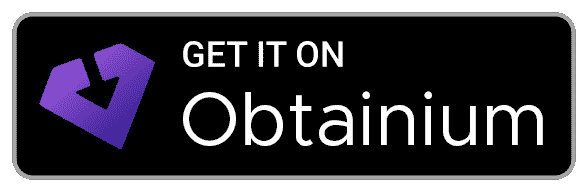

<div align="center"><a href="https://github.com/Safouene1/support-palestine-banner/blob/master/Markdown-pages/Support.md"></a></div>

<div align="center">
 
</div>

# Mah - Mahjong Solitaire

The original open-source Mahjong Solitaire game powering many Mahjong experiences on the web.  
**Completely free. No ads. No tracking. No cloud.**

## 🀄 [Play now in your browser](https://ffalt.github.io/mah/)

[](http://opensource.org/licenses/MIT)

[](https://github.com/ffalt/mah)
[](https://qlty.sh/gh/ffalt/projects/mah)
[](https://app.codacy.com/gh/ffalt/mah/dashboard?utm_source=gh&utm_medium=referral&utm_content=&utm_campaign=Badge_grade)

---

## ✨ Features

🧩 **84 built-in boards** - from classic layouts like Turtle and Dragon to unique custom designs

🌱 **Random seed based board generator** - enter or generate a custom seed to share or replay a specific randomly generated board for endless replayability

🎨 **13 tile image sets** - switch between beautiful tile designs in light and dark styles

🏆 **3 difficulty levels for features and boards generation** - from relaxed casual play to expert-level challenge

📅 **Daily challenge** - one board and one rule set per day, the same for everyone, with streaks, a result calendar and a best score per challenge type

🎯 **7 challenge types** - timed runs, score hunts and special tiles change how a board has to be cleared

🖼️ **Massive visual customization** - 8 image backgrounds, 375 pattern backgrounds, light/dark mode, 14 color themes, 3D tiles and shadows

🧘 **Zen mode** - hide the UI chrome for a clean, distraction-free playing experience

🔍 **Pan, zoom and rotate** - move and pinch-zoom the board, and optionally rotate it in portrait to fit wide layouts on a phone

⌨️ **Playable by keyboard** - tab and arrow key navigation everywhere, shortcuts for every game action, visible focus and screen reader announcements

⏱️ **Optional game timer** - show or hide the game clock to suit your play style

🎉 **Victory confetti** - optional celebratory confetti burst when you clear the board

💾 **Auto-save** - your game state and best times are saved locally in your browser, never to the cloud

📱 **Cross-platform** - runs in the browser, on desktop (macOS, Windows, Linux), and on Android

🌍 **37 languages, including right-to-left** - English, العربية, বাংলা, Català, Čeština, Dansk, Deutsch, Ελληνικά, Español, Euskara, فارسی, Suomi, Filipino, Français, हिन्दी, Magyar, Bahasa Indonesia, Italiano, 日本語, 한국어, Bahasa Melayu, Nederlands, Norsk, Polski, Português, Română, Русский, Svenska, Kiswahili, தமிழ், తెలుగు, ไทย, Türkçe, Українська, اردو, Tiếng Việt, 中文

---

## 📅 Daily Challenge

One board and one rule set per day, the same for everyone. A new challenge unlocks at midnight, your local time.
Your streak, your best streak, a won/played count and a calendar of past results are kept locally, and each challenge type keeps its own best score.

| Challenge    | Objective                                                                                           |
|--------------|-----------------------------------------------------------------------------------------------------|
| Midas Match  | Find and match the gold-marked tile. Hints and undo are allowed.                                    |
| Sparkstone   | Clear the board before time runs out. Matching the sparkstone adds time and marks a new one.        |
| Match Rush   | Make the target number of matches before time runs out. The board does not have to be cleared.      |
| Fortune Hunt | Reach the target score before time runs out. Fast matches in a row build a multiplier.              |
| Running Sand | You start with little time. Every match adds time, but only up to a limit. Clear the board in time. |
| The Purge    | Remove every tile of the marked suit before time runs out.                                          |
| Blackout     | Only free tiles show their face, covered tiles stay blank. Hints are allowed, undo is not.          |

---

## 🏛️ Explore More Boards

### [Mahjong Solitaire Layout Museum](https://ffalt.github.io/mahseum/)

Browse a curated archive of custom board layouts created by the Kyodai Mahjongg community.
Click any layout and select **"Play it with Mah"** to import it directly into your game.

---

## 📥 Download

Play instantly in the browser, or grab a native build for your platform:

<a href="https://github.com/ffalt/mah/releases" target="_blank"></a>
<a href="https://apps.obtainium.imranr.dev/redirect?r=obtainium://app/%7B%22id%22:%22io.github.ffalt.mah%22,%22url%22:%22https://github.com/ffalt/mah%22,%22author%22:%22ffalt%22,%22name%22:%22Mah%22%7D" target="_blank"></a>

|    | Platform | Available                                |
|----|----------|------------------------------------------|
| 🌐 | Web      | [Play now](https://ffalt.github.io/mah/) |
| 🍎 | macOS    | `.dmg` installer                         |
| 🪟 | Windows  | `.msi` / `.exe` installer                |
| 🐧 | Linux    | `.deb` / `.AppImage`                     |
| 🤖 | Android  | `.apk`                                   |

> [!IMPORTANT]
>
> **Unsigned apps/installers (macOS and Windows)**
>
> The macOS and Windows builds are not yet code-signed. Your OS may show a warning the first time you run the app - this is normal for unsigned software and **does not mean the files are malicious**.
> If you prefer to skip these warnings, [play in your browser](https://ffalt.github.io/mah/) instead.

<details>
<summary>🍎 <strong>macOS</strong> - bypassing Gatekeeper</summary>

Apple's Gatekeeper blocks apps from unidentified developers. You may see a message claiming the app is damaged - this is not true.

Remove the quarantine attribute to fix it:

```shell
xattr -dr com.apple.quarantine /Applications/mah.app
```

The exact steps may vary by macOS version - search for instructions specific to yours.

</details>

<details>
<summary>🪟 <strong>Windows</strong> - bypassing SmartScreen</summary>

Microsoft Defender SmartScreen shows a warning for unsigned apps.

Click **"More info"** → **"Run anyway"** to proceed.

</details>

<details>
<summary>🤖 <strong>Android</strong> - installing from APK</summary>

Android blocks installs from unknown sources by default. Go to **Settings → Security (or Apps)** and enable **Unknown Sources**.

Most modern phones use `arm64`. Try these APK variants in order:

1. `android-mah-x_y_z-arm64.apk`
2. `android-mah-x_y_z-arm.apk`
3. `android-mah-x_y_z-x86_64.apk`
4. `android-mah-x_y_z-x86.apk`

</details>

---

## 🙏 Acknowledgements

Mah's art is built on open-source creative work. See the credits for [artwork](src/assets/svg/README.md), [backgrounds](src/assets/img/README.md), [sounds](src/assets/sounds/README.md), [icons](src/app/components/icons/README.md) and [fonts](src/fonts/README.md).

---

## 🐳 Docker

Run Mah with a single command:

```bash
docker run -d -p 8080:80 ffalt/mah
```

Then open [http://localhost:8080](http://localhost:8080).

Or use Docker Compose:

```yaml
services:
  mah:
    image: ffalt/mah
    ports:
      - "8080:80"
```

For building your own docker container, see [resources/docker](./resources/docker/README.md).

---

## 🛠️ Development

### Build Config

The default game name is "Mah Jong". To change it:

1. Copy `custom-build-config.json.dist` to `custom-build-config.json`
2. Edit the name in `custom-build-config.json` to your desired app name

### Quick Start

```bash
npm run start         # Dev server → http://localhost:4200/
npm run build:prod    # Production build → dist/
npm run test          # Run unit tests
```
